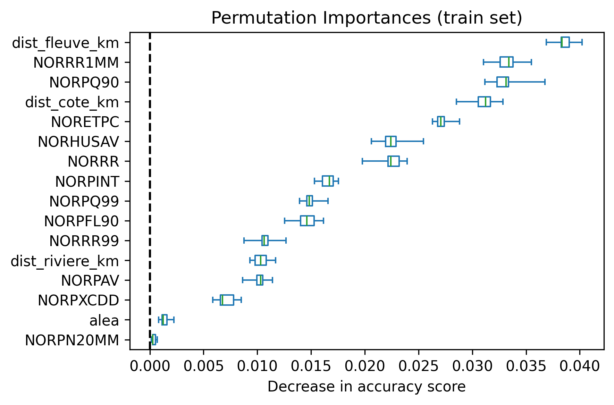
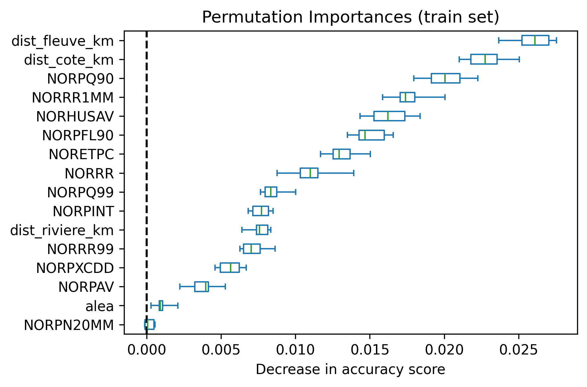
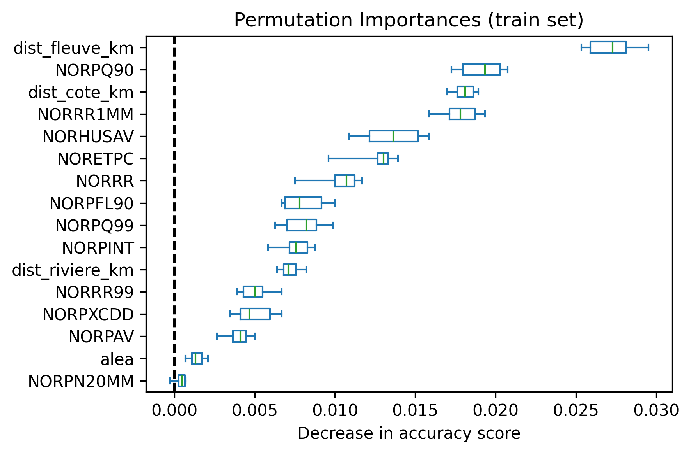
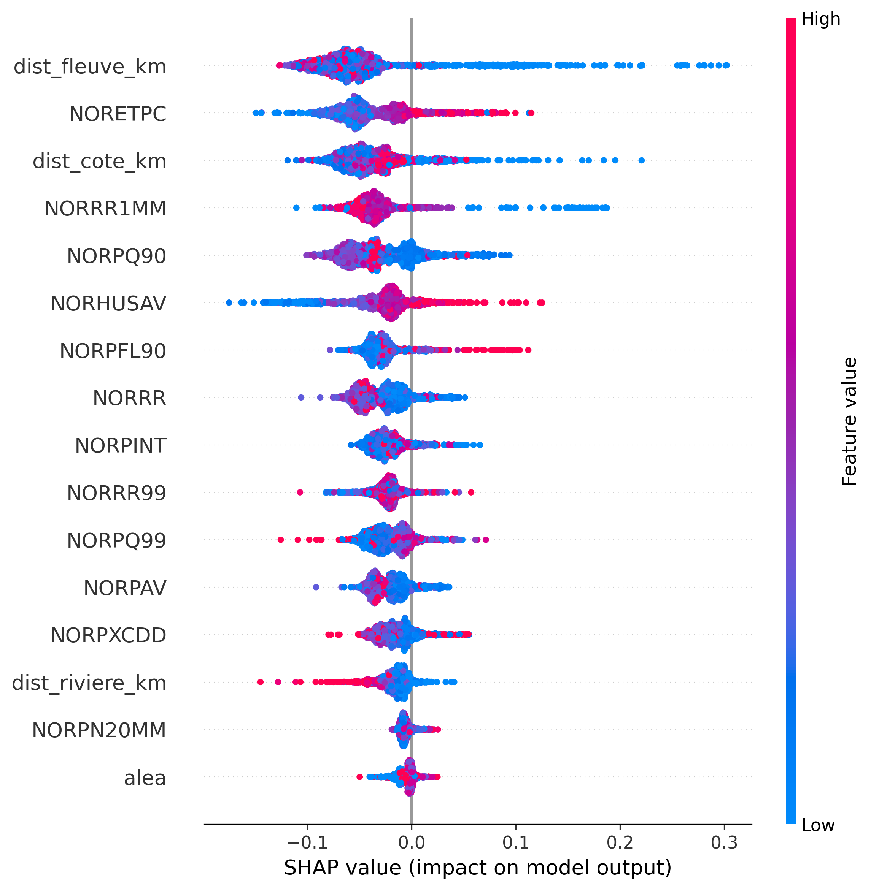
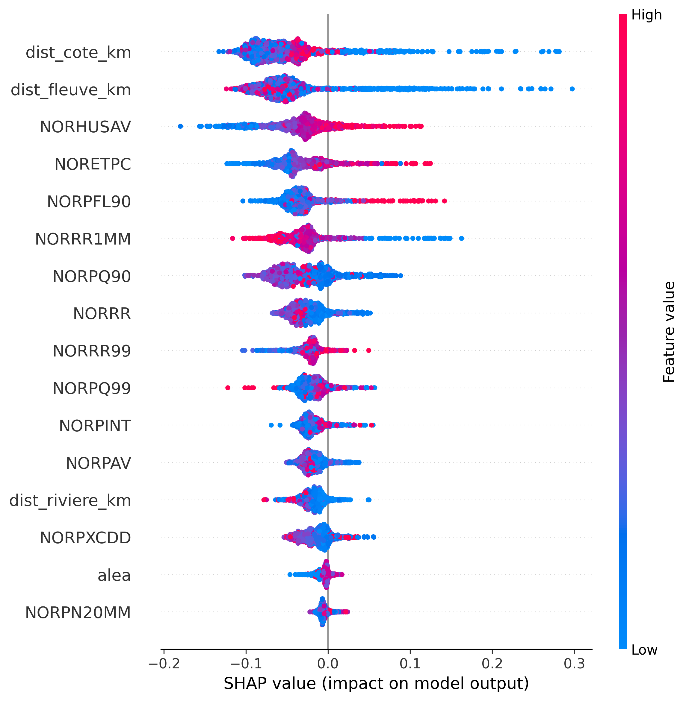
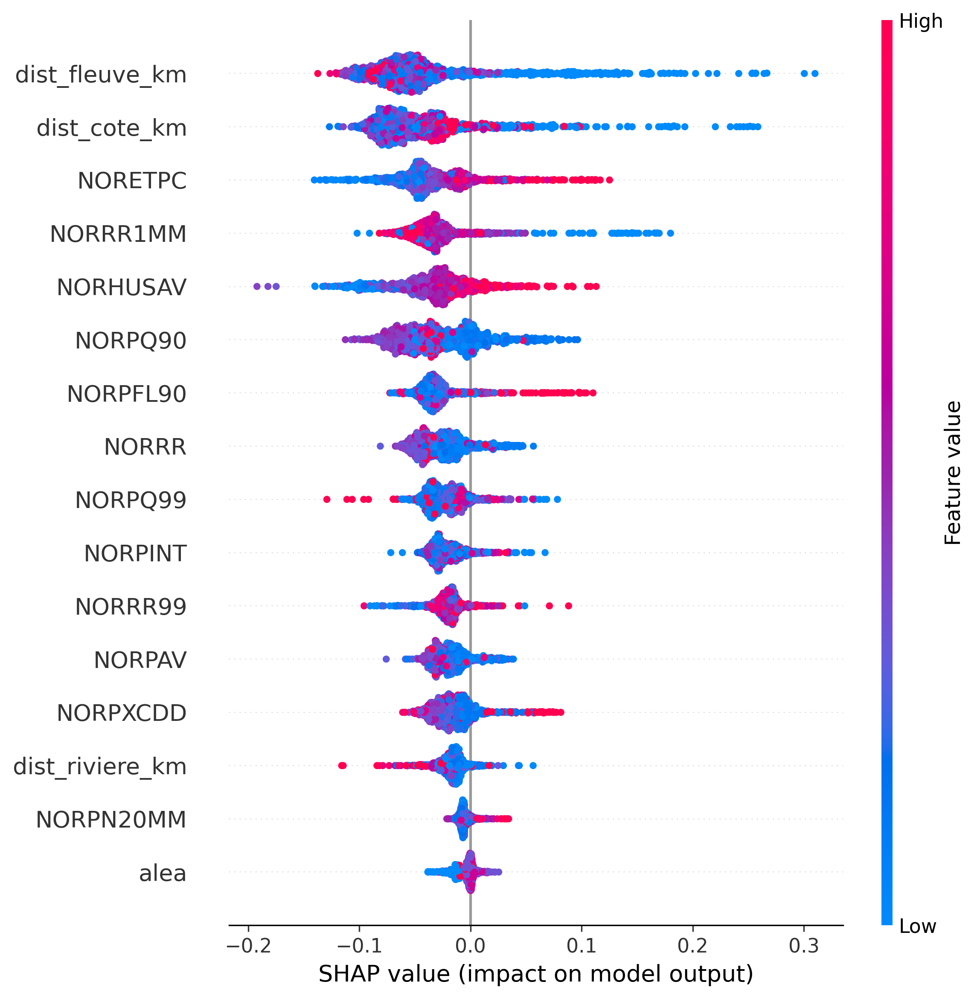
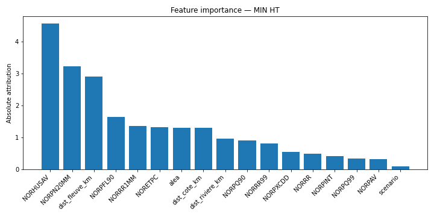
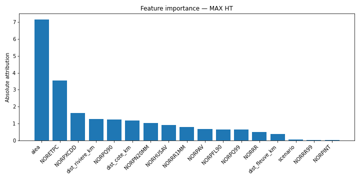
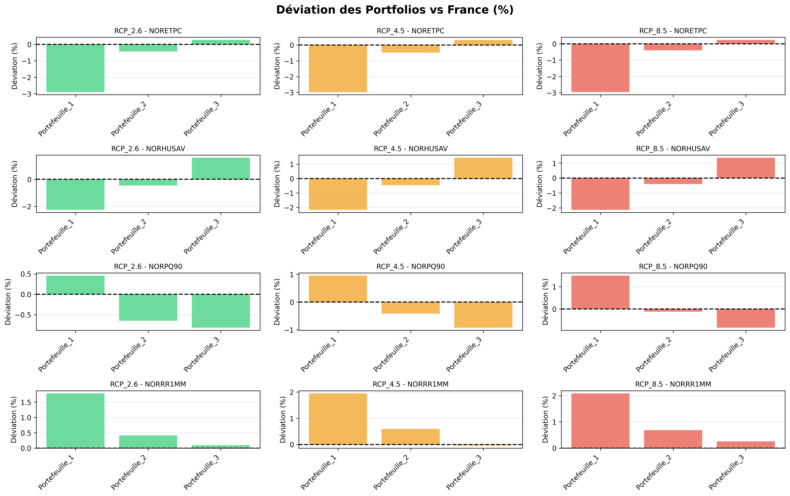
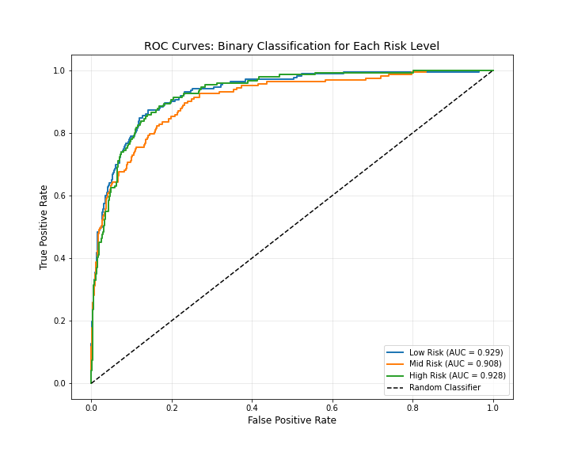

# Data Challenge

**Author:** Lucas Coussy  
**Date:** February 2026

---

## Introduction

---

## Inondation

### Données

Pour le risque d'inondation, nous avons utilisé plusieurs sources de données. Tout d'abord, nous avons utilisé les données [Drias](https://www.drias-climat.fr/) *Quantiles par horizon des indicateurs annuels 'DRIAS-2020'* dont les variables sélectionnées sont détaillées en Annexe dans la partie inondation.

Nous avons également utilisé les données disponibles sur [Géorisques](https://www.georisques.gouv.fr/donnees/bases-de-donnees/zonages-inondation-rapportage-2020) *Zonages Inondation - Rapportage 2020*, desquelles nous utilisons uniquement les fichiers du type *n\_iso\_ht*, ainsi que celles du même [site](https://www.georisques.gouv.fr/donnees/bases-de-donnees/retrait-gonflement-des-argiles-version-2026) sur le *Retrait-gonflement des argiles*.

De plus, afin d'avoir une carte complète de l'hydrographie en France, nous avons utilisé *Limites terre-mer - Métropole 2022 - BD Topage* du site [Data.gouv](https://www.data.gouv.fr/datasets/limites-terre-mer-metropole-2022-bd-topage-r?resource_id=8e282eb9-6f72-4f93-9951-0739957ffd40) ainsi que *Tronçons hydrographiques - Métropole 2017 - BD Carthage* du site [sandre.eaufrance.fr](https://www.sandre.eaufrance.fr/atlas/srv/api/records/1570d8de-f662-4a9f-8e70-dc83ef985c6c).

Enfin, afin de relier nos portefeuilles, dont la localisation était exprimée en communes, à une localisation géographique, nous avons utilisé les données *ADMIN-EXPRESS par territoire France Métropolitaine* du site [géoservices](https://geoservices.ign.fr/adminexpress).

### Nettoyage et formatage

Notre premier objectif a été de relier spatialement nos datasets.

Ainsi, nous avons créé 3 classes `Format_Flood_Data()`, `Format_Clay_Data()`, `Format_Hydrography_Data()` qui relient spatialement nos données Drias respectivement avec nos données *n\_iso\_ht*, nos données *ExpoArgile\_Fxx\_L93* et nos données *TronconHydrograElt\_FXX* et *LimiteTerreMer\_FXX*. Nous exportons ensuite nos données dans les fichiers csv suivants : *Flood\_risk\_results.csv*, *clay\_risk\_results.csv* et en fonction du scénario RCP *RCP\_2.6\_with\_distance.csv*, *RCP\_4.5\_with\_distance.csv* ou *RCP\_8.5\_with\_distance.csv*.

### Modélisation

Suite à notre nettoyage de données, notre objectif a alors été de modéliser notre risque d'inondation pour nos points en fonction des indicateurs Drias ainsi que de la distance vis-à-vis des cours d'eau, des fleuves et des côtes et en tenant compte de la présence de sols argileux.

Avant d'entrer dans la présentation de la modélisation, nous allons d'abord expliquer nos observations ainsi que nos hypothèses. L'observation qui a motivé cette modélisation du risque d'inondation est que les zones à risque d'inondations répertoriées par les *Zonages Inondation - Rapportage 2020* ne prennent pas en compte l'évolution future du risque en fonction du réchauffement climatique.

Pour nos hypothèses, nous avons d'abord considéré que nos données Drias pour la période H1 étaient les plus proches de nos conditions actuelles. Ensuite, nous avons également supposé que les zones d'aléa argileux étaient fixes dans le temps. De plus, nous avons supposé que les distances vis-à-vis des sources d'eau les plus proches (différents types de cours d'eau plus océan et mer) étaient aussi fixes.

Notre approche pour la modélisation a été de d'abord prédire la classe de risque (qui représente la période de retour de l'inondation) de nos points puis, en prenant le même input plus notre classe prédite, de prédire nos variables ht\_min et ht\_max qui représentent la hauteur minimale et maximale de l'inondation.

Nous plaçons ci-dessous nos inputs et outputs pour chaque modèle :

| Feature / Output | RF\_High | RF\_Mid | RF\_Low | Model\_HT |
|---|:---:|:---:|:---:|:---:|
| NORPAV | ✓ | ✓ | ✓ | ✓ |
| NORRR | ✓ | ✓ | ✓ | ✓ |
| NORRR1MM | ✓ | ✓ | ✓ | ✓ |
| NORPN20MM | ✓ | ✓ | ✓ | ✓ |
| NORPFL90 | ✓ | ✓ | ✓ | ✓ |
| NORPXCDD | ✓ | ✓ | ✓ | ✓ |
| NORPINT | ✓ | ✓ | ✓ | ✓ |
| NORPQ90 | ✓ | ✓ | ✓ | ✓ |
| NORPQ99 | ✓ | ✓ | ✓ | ✓ |
| NORRR99 | ✓ | ✓ | ✓ | ✓ |
| NORHUSAV | ✓ | ✓ | ✓ | ✓ |
| NORETPC | ✓ | ✓ | ✓ | ✓ |
| dist\_fleuve\_km | ✓ | ✓ | ✓ | ✓ |
| dist\_riviere\_km | ✓ | ✓ | ✓ | ✓ |
| dist\_cote\_km | ✓ | ✓ | ✓ | ✓ |
| alea | ✓ | ✓ | ✓ | ✓ |
| Flood\_Risk | | | | ✓ |
| **Output** | **Risk High** | **Risk Medium** | **Risk Low** | **ht\_min / ht\_max** |

Pour notre premier modèle, nous avons entraîné 3 random forests (plus efficaces que le HistGradientBoostClassifier pour les problèmes de classification binaire) à prédire si la classe de risque qu'il modélisait (High, Mid ou Low) était présente ou non. Ensuite, nous avons entraîné deux réseaux de neurones à prédire pour l'un ht\_min et pour l'autre ht\_max.

Nos résultats pour les random forests sont :

- **Low class :** accuracy = 0.9343, ROC auc = 0.9291
- **Mid class :** accuracy = 0.9366, ROC auc = 0.9079
- **High class :** accuracy = 0.9354, ROC auc = 0.9276

Nous plaçons ci-dessous nos résultats pour les deux réseaux de neurones prédisant ht\_min et ht\_max :

**Classification Report for `ht_min`**

| Class | Precision | Recall | F1-score | Support |
|---|:---:|:---:|:---:|---:|
| 0.0 | 1.00 | 0.99 | 0.99 | 69 707 |
| 1.0 | 0.45 | 1.00 | 0.62 | 493 |
| 2.0 | 0.53 | 1.00 | 0.70 | 492 |
| **Accuracy** | | **0.99** | | **70 692** |
| **Macro Avg** | 0.66 | 1.00 | 0.77 | 70 692 |
| **Weighted Avg** | 0.99 | 0.99 | 0.99 | 70 692 |

**Classification Report for `ht_max`**

| Class | Precision | Recall | F1-score | Support |
|---|:---:|:---:|:---:|---:|
| 0.0 | 1.00 | 0.99 | 1.00 | 66 643 |
| 1.0 | 0.90 | 0.94 | 0.92 | 3 141 |
| 2.0 | 0.73 | 0.99 | 0.84 | 454 |
| 3.0 | 0.79 | 1.00 | 0.88 | 418 |
| 4.0 | 0.86 | 1.00 | 0.92 | 36 |
| **Accuracy** | | **0.99** | | **70 692** |
| **Macro Avg** | 0.86 | 0.99 | 0.91 | 70 692 |
| **Weighted Avg** | 0.99 | 0.99 | 0.99 | 70 692 |

---

Maintenant, nous allons parler de l'importance des variables pour nos modèles ainsi que de l'interprétation de leurs prédictions.

**Permutation importance for the three models**

*High*

*Mid*

*Low*

Nous observons qu'outre les distances aux sources d'eau qui sont fixes donc non différenciantes pour nos prédictions, il y a NORPQ90, NORRR1MM et NORHUSAV qui ressortent dans le haut du classement des variables à fort impact sur les prédictions de nos modèles.

**SHAP summary plots for the three models**

| High | Mid | Low |
|:---:|:---:|:---:|
|  |  |  |

SHAP nous permet de visualiser le sens de l'impact qu'ont nos variables sur les prédictions. Ici, nous allons interpréter ces résultats pour les variables à fort impact identifiées plus haut. On observe que des valeurs élevées de NORRR1MM diminuent le risque d'inondation, alors que des valeurs élevées de NORHUSAV augmentent ces risques. Par contre, la séparation de nos données pour la variable NORPQ90 est moins évidente. Pour aller plus loin, on peut également noter que des valeurs élevées de NORETPC favorisent le risque d'inondation.

Pour nos modèles prédisant les hauteurs min et max de nos inondations, on a :

**Feature importance for height prediction models**

| ht\_min | ht\_max |
|:---:|:---:|
|  |  |

On observe que nos variables NORHUSAV, NORPN20MM et dist\_fleuve\_km sont particulièrement importantes pour prédire ht\_min et que alea (mesure du risque lié aux sols argileux) et NORETPC sont les variables les plus importantes pour la prédiction de ht\_max.

Enfin, nous exportons nos modèles dans un dossier model sous les noms *RandForestClassifier\_{risk}.pkl* avec risk notre classe de risque prédite par le modèle, et *model\_ht.pkl* notre modèle prédisant nos hauteurs d'inondation.

### Score

Pour obtenir notre score, nous appliquons tout d'abord notre classe `FloodScoring()` qui, pour nos différents scénarios RCP, applique nos modèles et estime la classe de risque d'inondation ainsi que nos hauteurs min et max, puis exporte ces résultats dans des fichiers de type *prediction\_data/{scenario}\_prediction.csv* avec scenario le scénario RCP considéré. Ensuite, nous calculons nos scores en appliquant à nos prédictions calculées précédemment notre classe `ScoreCreation()`.

#### Méthodologie de calcul du score de risque climatique d'inondation (approche additive)

##### Vue d'ensemble

Cette méthodologie calcule le risque d'inondation en traitant **chaque niveau de risque d'inondation (High, Mid, Low) indépendamment** puis en **sommant leurs contributions**.

Cela signifie que nous traitons les inondations avec différentes périodes de retour comme des aléas distincts.

##### Structure des données

###### Points

1. **Points géographiques** : Paires individuelles latitude-longitude $(L, l)$
2. **Communes** : Unités administratives pouvant englober plusieurs points

###### Caractéristiques des points

Chaque point (paire latitude-longitude) peut avoir plusieurs réalisations pour des combinaisons de :

- **Flood\_risk** : Classification du risque ∈ {High, Mid, Low}
- **Période** : Horizon temporel ∈ {H1, H2, H3}
- **ht\_min, ht\_max** : Plage de hauteur d'eau (mètres)

###### Horizons temporels

Notre variable **Période** prend trois valeurs différentes :

- **H1** : 2025–2050 (25 ans)
- **H2** : 2051–2070 (20 ans)
- **H3** : 2071–2099 (29 ans)

###### Périodes de retour

Nous déduisons notre **période de retour** de notre **Flood\_risk** comme défini dans la description de nos données (voir **COVADIS\_standard\_DI\_v2.1**).

| Flood Risk | Période de retour $T$ | Probabilité annuelle |
|---|:---:|:---:|
| High | 30 ans | 0.033 |
| Mid | 100-300 ans | 0.0033-0.01 |
| Low | 1000 ans | 0.001 |

La probabilité annuelle d'occurrence d'une inondation est obtenue en modélisant l'événement *"une inondation se produit durant l'année $i$"*, noté $X_i$, par une variable aléatoire de Bernoulli. On suppose donc que :

$$X_i \sim \mathcal{B}(p)$$

où $p$ est la probabilité annuelle d'inondation. Si $T$ désigne la période de retour (en années), cela signifie qu'en moyenne un événement se produit tous les $T$ ans. On a donc :

$$\mathbb{E}\left[\sum_{i=1}^{T} X_i\right] = 1$$

Par linéarité de l'espérance, on obtient :

$$\mathbb{E}\left[\sum_{i=1}^{T} X_i\right] = \sum_{i=1}^{T} \mathbb{E}[X_i] = T p$$

D'où :

$$T p = 1 \quad \Rightarrow \quad p = \frac{1}{T}$$

Ainsi, la probabilité annuelle d'occurrence d'une inondation est l'inverse de la période de retour.

##### Cadre mathématique

**Principe de base :** Le risque total à un emplacement est :

$$\text{Risk}_{\text{total}} = \text{Risk}_{\text{High}} + \text{Risk}_{\text{Mid}} + \text{Risk}_{\text{Low}}$$

Chaque niveau de risque contribue **indépendamment** à la perte attendue totale.

**Calcul du risque par niveau**

Pour chaque niveau de risque d'inondation $r \in \{\text{High, Mid, Low}\}$ :

**1. Allocation temporelle**

Le temps restant avant la maturité est réparti sur nos trois périodes différentes. Ainsi, le temps restant dans la période $H_i$ avant la maturité est $n_{L,l,H_i}$ :

$$n_{L,l,H1} = \min(n_{L,l},\ 25)$$

$$n_{L,l,H2} = \min(n_{L,l} - n_{L,l,H1},\ 20)$$

$$n_{L,l,H3} = n_{L,l} - n_{L,l,H1} - n_{L,l,H2}$$

où $n_{L,l}$ est le nombre total d'années restant jusqu'à la maturité.

**2. Probabilité de survie par période**

Pour le niveau de risque d'inondation $r$ dans la période $h$, nous définissons notre *Survival* comme :

$$\text{Survival}_{L,l,h,r} = \left(1 - \frac{1}{T_r}\right)^{n_{L,l,h}}$$

**Survival** est la probabilité d'éviter ce niveau de risque d'inondation spécifique pendant la période $h$.

**3. Survie multi-périodes**

La probabilité d'éviter le niveau de risque d'inondation $r$ sur toutes les périodes :

$$\text{Survival}_{L,l,r} = \text{Survival}_{L,l,H1,r} \times \text{Survival}_{L,l,H2,r} \times \text{Survival}_{L,l,H3,r}$$

**4. Probabilité d'inondation**

Probabilité que le niveau de risque d'inondation $r$ se produise au moins une fois :

$$P_{L,l,r} = 1 - \text{Survival}_{L,l,r}$$

**5. Facteur de dommage**

Pour chaque période $h$ où des données du type d'inondation $r$ existent, nous définissons nos dommages en fonction de $\text{ht\_min}_{h,r}$ et $\text{ht\_max}_{h,r}$ :

$$\text{damage}_{L,l,h,r} = \frac{1}{1 + \exp\left(1 - \frac{\text{ht\_min}_{h,r} + \text{ht\_max}_{h,r}}{2}\right)}$$

Nous considérons ici que nous perdons la moitié de la valeur de nos actifs lorsque notre hauteur moyenne atteint 1 mètre. C'est probablement surestimé, mais en raison d'un manque d'informations sur l'impact de la hauteur d'une inondation sur la perte économique, nous utiliserons cette mesure pour nos dommages.

Ensuite, nous calculons une moyenne pondérée dans le temps sur les périodes pour obtenir le $\text{damage\_factor}$ total pour ce risque :

$$\text{damage\_factor}_{L,l,r} = \frac{\sum_{h \in \{H1,H2,H3\}} n_{L,l,h} \cdot \text{damage}_{L,l,h,r}}{n_{L,l}}$$

**6. Risque pour le type $r$**

Ensuite, pour notre risque $r$, notre perte attendue (en proportion de la valeur de l'actif) est :

$$\text{Risk}_{L,l,r} = P_{L,l,r} \times \text{damage\_factor}_{L,l,r}$$

**Risque total**

Nous sommons ensuite nos risques partiels pour obtenir notre risque total :

$$\text{Risk}_{L,l} = \sum_{r \in \{\text{High, Mid, Low}\}} \text{Risk}_{L,l,r}$$

> **Attention** : théoriquement, ce risque est défini dans l'intervalle [0, 3], mais en pratique reste dans [0, 1] car les probabilités sont faibles.

##### Hypothèses

1. **Indépendance entre années** : On suppose que les inondations sont indépendantes d'une année à l'autre.
2. **Indépendance des risques d'inondations** : Nos différents niveaux de risques d'inondations sont des événements supposés indépendants.
3. **Linéarité** : Les dommages de différents types d'inondations sont additifs (pas multiplicatif).
4. **Stationnarité** : Probabilités d'inondation constantes au sein de chaque période de 20-30 ans.
5. **Homogénéité** : Tous les points de la commune sont pondérés de manière égale (car on ne connait pas la localisation précise).

##### Résumé

Cette méthodologie additive traite chaque type de risque d'inondation comme une source indépendante de perte. En calculant la probabilité et le damage\_score pour les risques High, Mid et Low séparément et en les sommant, nous obtenons un score de risque total qui représente la proportion de la valeur de l'actif qui devrait être perdue sur la durée de vie du prêt.

### Résultats

Le montant total d'actifs en euros pour chacun de nos portefeuilles est :

- **Portefeuille 1** : 5 340
- **Portefeuille 2** : 4 934
- **Portefeuille 3** : 5 112

Avec ces portefeuilles nous avons obtenue les résultats suivants.

**Risque financier total par portefeuille et scénario RCP (%)**

| | RCP 2.6 | RCP 4.5 | RCP 8.5 |
|---|:---:|:---:|:---:|
| **Portefeuille 1** | 3.45 🟢 | 60.96 🟠 | 5.87 🟢 |
| **Portefeuille 2** | 53.50 🟠 | 80.49 🔴 | 55.45 🟠 |
| **Portefeuille 3** | 69.51 🔴 | 120.30 🔴 | 60.14 🔴 |

> Les couleurs représentent le niveau de risque : 🟢 faible, 🟠 modéré, 🔴 élevé. Les barres dans le document original représentent 10% du total des actifs des portefeuilles.

Ainsi dans le pire des cas, qui est notre portefeuille 3 avec le scenario RCP 4.5, 120 millions d'euros d'actifs sont perdus (ce qui represente environ 2.3% de nos actifs totaux).

### Visualisation

Enfin, nous visualisons nos prédictions avec nos portefeuilles afin de comprendre les résultats ainsi obtenus avec notre classe `Portfolio_Context_Explained()` et exportons nos visualisations dans un fichier visuals.

**Deviation plot**

On voit nos différence entre nos portefeuilles selon les scénarios et les variables considérés (ici on à conservé les variables à fort impact).

Ces graphiques avec nos résultats confirment bien l'interpretation des graphiques shap de nos modèles. En effet, on voit que le portefeuille 3 qui subit en générales les pertes les plus importantes est associé à des NORRR1MM proche de la moyenne, des NORPQ90 fortement infèrieur à la moyenne, des NORHUSAV fortement supèrieur à la moyenne et des NORETPC proche de la moyenne et ce pour chacun des scénarios considéré. Ces observations vont bien dans le sens des interprétations faites sur nos modèles.

### Limites

- Ce modèle ne tient pas compte du secteur d'activité de l'actif considérer.
- Hypothèse forte d'indépendances des risques d'inondations.
- Données Drias précise à 8 km près, ce qui laisse une marge d'erreur non négligeable.
- Prédiction catégorielle des hauteurs (notre modèle ne peut prédire que les classes sur lesquelles il a été entraîné, c'est-à-dire jusqu'à 5 mètres).

---

## Annexe

### Inondation

La partie inondation du projet est disponible à cette page [Github](https://github.com/Lucas-Coussy/Data-Challenge_Climate_Risks).

### Détail des données

L'ensemble des données utilisées sont disponible sur cette page [huggingface](https://huggingface.co/datasets/Lambda-ck/Climate-Data-Challenge/tree/main).

#### Drias

| Variable | Description |
|---|---|
| **Point** | Identifiant du point d'observation |
| **Latitude** | Latitude géographique (degrés) |
| **Longitude** | Longitude géographique (degrés) |
| **Contexte** | Précise les scénarios RCP considérés |
| **Période** | Période temporelle considérée (H1 : 2021-2050, H2 : 2051-2070, H3 : 2070-2099) |
| **NORPAV** | Précipitations journalières moyennes (mm) |
| **NORRR** | Cumul de précipitations (mm) |
| **NORRR1MM** | Nombre de jours de pluie (jour(s)) |
| **NORPN20MM** | Nombre de jours de fortes précipitations (jour(s)) |
| **NORPFL90** | Fraction des précipitations journalières intenses (%) |
| **NORPXCDD** | Période de sécheresse (jour(s)) |
| **NORPINT** | Précipitation moyenne les jours pluvieux (mm) |
| **NORPQ90** | Précipitations intenses (Q90) (mm) |
| **NORPQ99** | Précipitations extrêmes (Q99) (mm) |
| **NORRR99** | Nombre de jours de précipitations intenses (jours où le Q99 est dépassé) (jour(s)) |
| **NORHUSAV** | Humidité spécifique moyenne (g/kg) |
| **NORETPC** | ETP cumulée (mm) |

#### Portefeuille

| Variable | Description |
|---|---|
| **Identifiant tiers** | Valeur unique permettant d'identifier la contrepartie |
| **Localisation (Communes)** | Nom de la commune où est localisée l'actif |
| **Localisation (Code INSEE)** | Code unique permettant d'identifier la commune où est localisée l'actif |
| **Secteur d'activité (Code NACE 2)** | Code unique permettant d'identifier le secteur d'activité du tiers |
| **Maturité du prêt** | Date d'échéance finale du prêt |
| **Encours (million EUR)** | Répartition de l'encours du prêt par site |

#### Modélisation

On place ci-dessous le graphique de nos courbes Roc pour nos classifieurs binaires.

**Classifiers ROC Curves**

